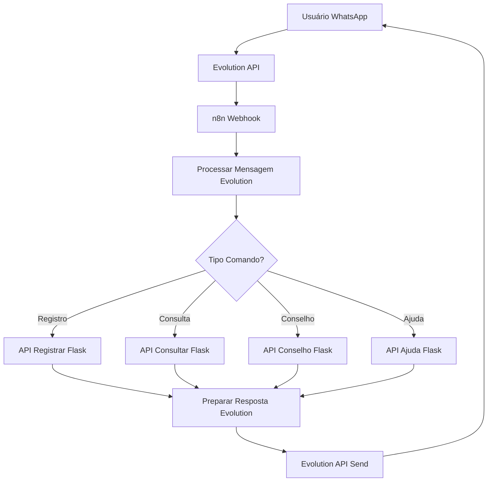

# 🤖 Assistente Financeiro WhatsApp + n8n + Evolution API

Um assistente financeiro inteligente que funciona via WhatsApp usando n8n para automação, Evolution API para comunicação WhatsApp e Flask como backend.

## 📋 Visão Geral

Este projeto combina:
- **Backend Flask**: API para gerenciar gastos e usuários
- **n8n**: Automação do fluxo WhatsApp
- **Evolution API**: Interface de comunicação WhatsApp (não oficial)
- **Google Gemini AI**: Geração de conselhos financeiros
- **SQLite/PostgreSQL**: Armazenamento de dados

## 🚀 Como Funciona

1. **Usuário envia mensagem** via WhatsApp
2. **n8n recebe webhook** e processa a mensagem
3. **Classifica o comando**: registro, consulta, conselho ou ajuda
4. **Chama API Flask** correspondente
5. **Retorna resposta** formatada via WhatsApp

## 📱 Comandos Disponíveis

| Comando | Exemplo | Descrição |
|---------|---------|-----------|
| **Registro** | `Almoço 25.50 alimentação` | Registra um gasto |
| **Consulta Diária** | `#dia` | Mostra gastos do dia |
| **Consulta Mensal** | `#mes` | Mostra gastos do mês |
| **Conselho** | `#conselho` | Gera dica financeira com IA |
| **Ajuda** | `ajuda` ou `help` | Mostra instruções |

## 🛠️ Configuração

### 1. Backend Flask (Railway)

```bash
# Variáveis de ambiente necessárias
GEMINI_API_KEY=sua_chave_gemini
DATABASE_URL=postgresql://... (opcional, usa SQLite se não definido)
PORT=8080
```

### 2. Evolution API (Configurar Instância)

1. **Instale e configure a Evolution API**:
   ```bash
   # Clone o repositório da Evolution API
   git clone https://github.com/EvolutionAPI/evolution-api.git
   cd evolution-api
   
   # Configure as variáveis de ambiente
   cp .env.example .env
   # Edite o .env com suas configurações
   
   # Execute com Docker
   docker compose up -d
   ```

2. **Crie uma instância**:
   ```bash
   curl -X POST 'http://localhost:8080/instance/create' \
   -H 'Content-Type: application/json' \
   -H 'apikey: SUA_API_KEY' \
   -d '{
     "instanceName": "assistente-financeiro",
     "token": "TOKEN_OPCIONAL",
     "qrcode": true,
     "webhook": "https://seu-n8n.com/webhook/whatsapp-webhook",
     "webhookByEvents": false,
     "events": ["MESSAGES_UPSERT"]
   }'
   ```

3. **Conecte o WhatsApp**:
   - Acesse: `http://localhost:8080/instance/connect/assistente-financeiro`
   - Escaneie o QR Code com seu WhatsApp

### 3. n8n (Importar Fluxo)

1. Importe o arquivo `n8n-assistente-financeiro-whatsapp.json`
2. Configure as variáveis de ambiente:
   ```
   API_BASE_URL=https://seu-backend.railway.app
   EVOLUTION_API_URL=http://localhost:8080
   EVOLUTION_API_KEY=sua_api_key_evolution
   EVOLUTION_INSTANCE_NAME=assistente-financeiro
   ```

## 📁 Estrutura do Projeto

```
/
├── src/                          # Código fonte Flask
│   ├── models/                   # Modelos do banco
│   │   ├── user.py              # Modelo usuário
│   │   └── gasto.py             # Modelo gasto
│   ├── routes/                   # Rotas da API
│   │   ├── user.py              # Endpoints usuário
│   │   └── financeiro.py        # Endpoints financeiros
│   └── main.py                   # App principal
├── n8n-assistente-financeiro-whatsapp.json  # Fluxo n8n
├── CONFIGURACAO_N8N.md          # Guia configuração
├── teste-n8n-webhook.py         # Script de teste
├── exemplo-webhook-whatsapp.json # Exemplos payload
├── requirements.txt              # Dependências Python
├── Dockerfile                    # Container config
├── run.sh                       # Script inicialização
└── wsgi.py                      # WSGI entry point
```

## 🧪 Testando

### Teste Automático
```bash
# Edite a URL no script
python3 teste-n8n-webhook.py

# Ou teste individual
python3 teste-n8n-webhook.py --individual
```

### Teste Manual
1. Envie mensagem WhatsApp para seu número business
2. Verifique logs no n8n (Executions)
3. Confirme resposta recebida

## 📊 Endpoints da API

| Método | Endpoint | Descrição |
|--------|----------|-----------|
| `POST` | `/api/financeiro/registrar_gasto` | Registra gasto |
| `POST` | `/api/financeiro/consultar_gastos` | Consulta gastos |
| `POST` | `/api/financeiro/gerar_conselho` | Gera conselho IA |
| `POST` | `/api/financeiro/ajuda` | Retorna ajuda |

### Exemplo Payload Registro:
```json
{
  "user_id": "5511999887766",
  "descricao": "Almoço",
  "valor": "25.50",
  "categoria": "alimentação"
}
```

## 🔧 Desenvolvimento

### Executar Localmente
```bash
# Instalar dependências
pip install -r requirements.txt

# Executar
python src/main.py
```

### Deploy Railway
```bash
# Commit e push para GitHub
git add .
git commit -m "Deploy assistente financeiro"
git push

# Railway fará deploy automático
```

## 🛡️ Segurança

- ✅ Validação de tokens WhatsApp
- ✅ Sanitização de inputs
- ✅ Rate limiting (recomendado)
- ✅ HTTPS obrigatório
- ✅ Logs de auditoria

## 📈 Monitoramento

### n8n
- Executions: Sucesso/falha dos fluxos
- Logs: Debug detalhado
- Performance: Tempo de resposta

### Railway
- Logs da aplicação
- Métricas de performance
- Status do banco de dados

## 🐛 Troubleshooting

### Erro: "Webhook não recebe mensagens"
1. Verifique se a Evolution API está rodando
2. Confirme se a instância está conectada
3. Verifique URL do webhook no n8n
4. Teste webhook manualmente

### Erro: "Instância não conecta"
1. Verifique se o QR Code foi escaneado
2. Confirme se o WhatsApp está ativo no celular
3. Reinicie a instância se necessário:
   ```bash
   curl -X DELETE 'http://localhost:8080/instance/logout/assistente-financeiro' \
   -H 'apikey: SUA_API_KEY'
   ```

### Erro: "API não responde"
1. Verifique se backend está rodando
2. Confirme variável `API_BASE_URL` no n8n
3. Teste endpoints diretamente

### Erro: "Evolution API não envia mensagens"
1. Verifique se `EVOLUTION_API_KEY` está correta
2. Confirme se `EVOLUTION_INSTANCE_NAME` existe
3. Teste endpoint de envio diretamente:
   ```bash
   curl -X POST 'http://localhost:8080/message/sendText/assistente-financeiro' \
   -H 'Content-Type: application/json' \
   -H 'apikey: SUA_API_KEY' \
   -d '{
     "number": "5511999887766",
     "text": "Teste de mensagem"
   }'
   ```

### Erro: "Conselho não gerado"
1. Verifique `GEMINI_API_KEY`
2. Confirme quota da API Gemini
3. Verifique logs do backend

## 🔄 Fluxo Completo



## 🔧 Comandos Úteis Evolution API

### Listar Instâncias
```bash
curl -X GET 'http://localhost:8080/instance/fetchInstances' \
-H 'apikey: SUA_API_KEY'
```

### Status da Instância
```bash
curl -X GET 'http://localhost:8080/instance/connectionState/assistente-financeiro' \
-H 'apikey: SUA_API_KEY'
```

### Reiniciar Instância
```bash
curl -X PUT 'http://localhost:8080/instance/restart/assistente-financeiro' \
-H 'apikey: SUA_API_KEY'
```

### Deletar Instância
```bash
curl -X DELETE 'http://localhost:8080/instance/delete/assistente-financeiro' \
-H 'apikey: SUA_API_KEY'
```

## 📞 Suporte

Para dúvidas ou problemas:
1. Verifique logs do n8n e Railway
2. Teste endpoints individualmente
3. Confirme configurações das variáveis
4. Valide tokens e permissões da Evolution API
5. Verifique se a instância WhatsApp está conectada

---

**🎉 Seu assistente financeiro está pronto para usar!**